# Quantum-Inspired Traffic Optimization: System Architecture

This document describes the high-level system architecture and component interactions of the routing optimization platform.

---

## 1. High-Level Architecture Flow

```mermaid
graph TD
    User([User / Operator]) -->|Configures Parameters| UI[React Frontend Dashboard]
    UI -->|API Requests| API[FastAPI REST Backend]

    subgraph Backend [FastAPI Application]
        API --> Router[API Routers: traffic, optimization, benchmark]
        Router --> State[State Manager: Memory Graph & Simulator]
        
        subgraph Graph & Traffic Engine
            State --> GraphModel[TrafficGraph: Node & Edge attributes]
            State --> Simulator[TrafficSimulator: Hour & Dynamic Incidents]
            Simulator --> BPR[BPR Delay Function]
        end

        subgraph Swarm Optimization Core
            Router --> Decoders[Route Decoders: Priority SP, Random Keys VRP]
            Router --> Solvers[Optimization Solvers: Classical PSO, Basic QPSO, Improved QPSO]
            Solvers --> Fitness[RouteEvaluator: Time, Distance, Congestion, Risk]
            Solvers --> Constraints[Constraints & Penalty Handler]
        end

        subgraph Research Analytics
            Router --> Runner[BenchmarkRunner]
            Runner --> Stats[Statistical Tests: Mann-Whitney U]
        end
    end

    GraphModel -->|Nodes, Edges & Congestion| Map[Leaflet Map Layer]
    Solvers -->|Decoded Paths & Routes| Map
    Runner -->|Convergence & Diversity Logs| Charts[Recharts Panel]
    Stats -->|Hypothesis Test Results| Tables[Statistical Summary Panel]
    
    Map --> UI
    Charts --> UI
    Tables --> UI
```

---

## 2. Key Components

### A. React Frontend Dashboard (`frontend/`)
A single-page application built with Vite, React, and TypeScript.
- **Leaflet Map**: Interactively renders nodes and edges. Paths are highlighted with different colors. Congestion is dynamically colored from green (free flow) to red (jammed).
- **Recharts Panels**: Plots convergence history and swarm diversity decays.
- **Statistical Panel**: Details final fitness distributions, runtimes, and Mann-Whitney U test p-values.

### B. FastAPI REST API (`backend/app/api/`)
Serves as the gateway for request routing and state preservation.
- Maintains an in-memory `TrafficGraph` and `TrafficSimulator` representing the virtual smart-city transportation state.
- Exposes routes to update simulation time, register road incidents, run single optimizations, and run benchmarks.

### C. Traffic Simulation Engine (`backend/app/traffic/`)
Simulates spatial and temporal traffic variations:
- **Diurnal curve**: Models rush-hour congestion peaks at 8:00 AM and 5:00 PM.
- **Incident Injection**: Models lane blocks or accident speed limits, updating edge travel times dynamically using the Bureau of Public Roads (BPR) delay formula.

### D. Optimization Solvers (`backend/app/optimization/`)
Contains raw, manual implementations of PSO, QPSO, and Improved QPSO, avoiding black-box dependencies.
- **Classical PSO**: Models inertia weight linear decay and velocity clamping.
- **Basic QPSO**: Models delta potential well attraction and mbest position updates.
- **Improved QPSO**: Implements diversity feedback loops for adaptive contraction-expansion and Cauchy mutation to escape stagnation.
- **Decoders**: Transforms continuous coordinates into discrete shortest-path node lists or capacity-constrained VRP vehicle routes.
